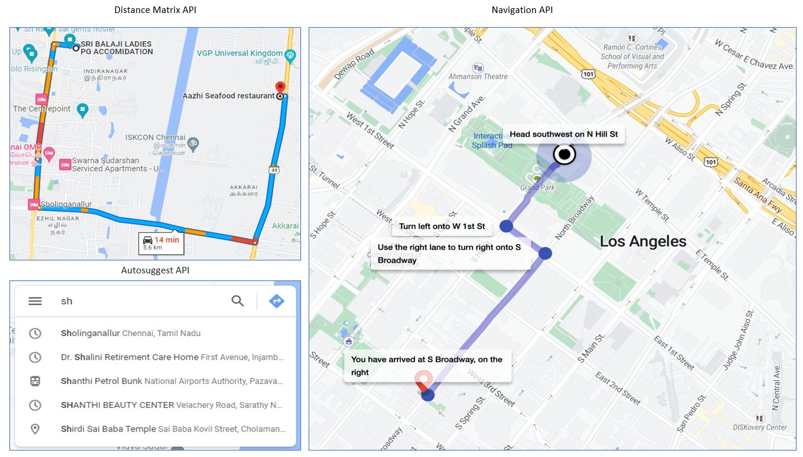

_(Please read the Readme.md file before reading this file)_
# Demonstration to the Client
This file contains the presentation script of the demonstration to the prospective client.

# Introduction
- The client shall be given a brief introduction about his/her requirements and what nextbillion.ai has to offer for the same.
- We shall convey to the client that a simple demonstration is prepared to preside over the discussion.

# Walkthrough the Demonstration
_(It is Assumed that the demo file is opened in a browser and shared with the client)_
- Route Anywhere is a basic navigation application which is prepared to demonstrate the generation of route direction between two locations.
- Explain the working of the application.
- Convey that the application is only for demo purpose and nextbillion.ai has API's and SDK's to solve and improvise the Maps, Navigation, and Places in their existing application.

# Taking the Discussion to API Suggestions
- The APIs of nextbillion.ai shall be suggested to the client based on the discussions.
- Some of the key APIs that shall be suggested for the application would be, 
  - Distance Matrix API - to get user defined mode of transportation and generate the distance to reach the destination.
  - Navigation API - The Navigation API can be used as an input into your Navigation app. Alternatively, you can directly use nextbillion.ai’s Navigation SDK for a complete turn by turn navigation experience.
  - AutoSuggest API - This API shall be used in the search criteria to suggest address or place based on an incomplete or misspelled query, from which the user shall select the best query to submit.
  - The sample UI of the APIs and SDKs shall be presented to the client via images

# Client's Call
- After the demo, the client's call on the API and SDK requirement is noted
- Technical specific requirements if any is shared with the client and the nextbillion.ai team.
